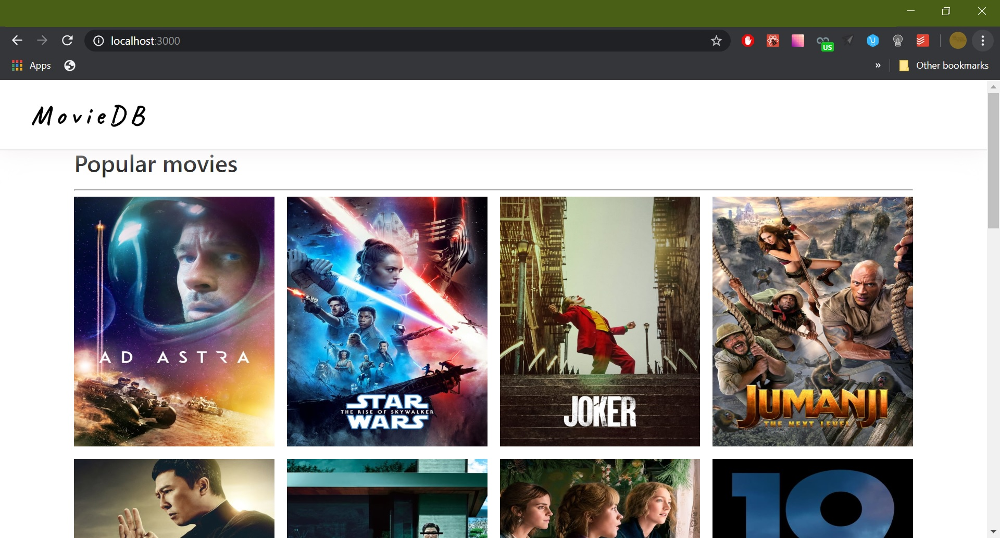
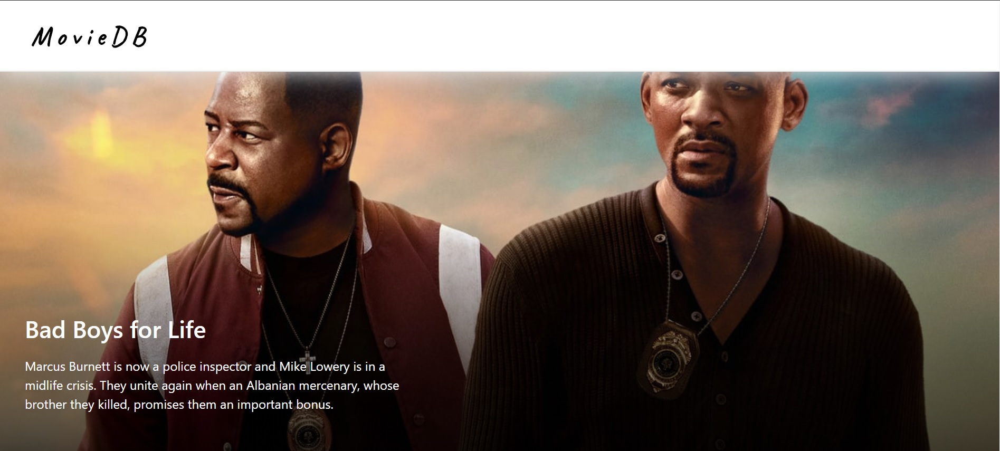
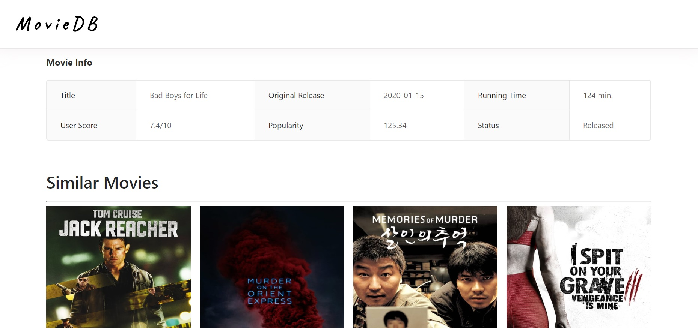

# REACT-MOVIEDB-APP

REACT-MOVIEDB is a simple movie information engine made with ReactJS and powered by [The Movie DataBase] API.

### Demo

---

1.  **Home page**
    

2.  **Selected movie and first information**
    

3.  **Main information about movie**

    

### Installation

If you want to continue codding:

1. Clone the repo: `git clone https://github.com/valerasamoylov/react-mongodb-app.git`
2. Select a directory: `cd react-mongodb-app`
3. Install packages: `npm install`
4. Launch project: `npm start`

[the movie database]: https://www.themoviedb.org/
